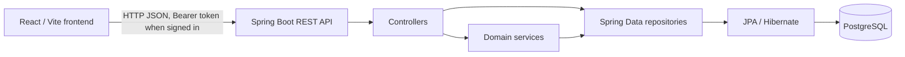

# Winter Olympics

A university project for managing Ski Slalom and Biathlon competitions through a React web application and a Spring Boot REST API.

## Overview

Winter Olympics brings competition setup, athlete and country records, registrations, result entry, rankings, medals, and Olympic statistics into one application. Public visitors can browse competition and results data; signed-in athletes can view their linked profile and manage their registrations; administrators can manage core records and seed demonstration data.

The repository contains a Java backend in `BE/` and a React frontend in `FE/`. The deployment target described for this project is Vercel for the frontend and Railway for the backend and PostgreSQL. The repository does not contain Vercel or Railway deployment manifests or public deployment URLs; configuration is environment-driven.

## Main Features

- Public home, competition list and details, rankings, medal standings, and statistics.
- Athlete records with country, gender, and date of birth.
- Ski Slalom and Biathlon competitions. Biathlon events include lap and shooting-lap settings.
- Competition registration with athlete ownership, gender, age, and duplicate-registration checks.
- Slalom first-run and second-run result entry, qualification lists, start order, and completed-result ranking.
- Biathlon result entry with ski time, misses, per-miss penalty, finish status, and ranking.
- Medal tables derived from the top three results in each competition, and participant/medalist age statistics.
- JWT login and account registration in the backend, with `ADMIN` and `ATHLETE` roles.
- Admin UI for athletes, competitions, registrations, and an overview with test-data and full application-data reset actions.
- Athlete UI for viewing/updating a linked profile and managing competition registrations.

Some routed screens are placeholders: the frontend Register page, Athlete Dashboard, and Admin Slalom/Biathlon Results pages do not yet implement their corresponding workflows. See [Known Limitations](#known-limitations).

## Competition Rules

### Ski Slalom

- A first-run result records a positive time and a finish flag for a competition registration.
- The second-run participant list includes athletes who have a recorded, finished first run. It is sorted by first-run time and limited to 30.
- Second-run start order reverses that qualified list, so the slowest first-run qualifier starts first.
- An athlete must have a first-run result, must have finished it, and must be in the qualified group before a second-run result can be saved.
- Final time is the sum of the two run times, and is calculated only when both runs are marked finished.
- The ranking includes only athletes who finished both runs and orders them by final time. DNF athletes are omitted from the ranking.

### Biathlon

- Each Biathlon competition stores a number of laps and a shooting-after-lap setting. Both are required; the shooting lap cannot exceed the lap count. Slalom competitions must have both fields set to `null`.
- A result stores ski time, an aggregate miss count, penalty seconds per miss, and a finish flag. The API does not record individual shooting-stage entries.
- Penalty time is `misses × penaltyPerMiss`; final time is `skiTime + penaltyTime` for a finisher.
- Only finished results with a ski time appear in the ranking, ordered by final time. A non-finisher has no final time and is omitted.

## User Roles

| Actor | Current access |
| --- | --- |
| Public visitor | Login and registration endpoints; public competition reads; result-ranking, medal, and statistics reads. Other API routes require authentication. |
| `ATHLETE` | Own profile via `/api/athletes/me`; own profile update/delete; registrations filtered to and managed for the linked athlete; authenticated country reads. |
| `ADMIN` | Athlete, competition, country, registration, result, and test-data management; all registrations and athlete records; public data. |

The backend enforces permissions independently of the frontend route guards. An account created by public registration is not automatically linked to an athlete record. The test-data workflow creates its own linked demo accounts; there is no general public/admin account-linking API.

## Technology Stack

- Java 21; Spring Boot 4.0.8; Spring Web MVC; Spring Security; Spring Data JPA/Hibernate; Jakarta Validation.
- PostgreSQL JDBC driver; local PostgreSQL 17 Alpine image in Docker Compose.
- JWT implementation: JJWT 0.12.6; passwords encoded with Spring Security BCrypt.
- Maven wrapper and Maven Compiler Plugin.
- React 19.2.8, React DOM 19.2.8, React Router 7.18.4, TypeScript 7.0.2, Vite 5.4.21.
- Deployment target: Vercel frontend, Railway backend and PostgreSQL. No production URL is recorded in this repository.

## Architecture



CRUD controllers commonly use repositories directly. Slalom, Biathlon, statistics, and demo-data behavior is implemented in services. See [Architecture](docs/architecture.md).

## Project Structure

```text
BE/
  src/main/java/com/example/winter_olympics/
    config/       Security, JWT filter, exception handling, initialization
    controller/   REST endpoints
    dto/          Request and response objects
    entity/       JPA entities and enums
    exception/    Typed application exceptions
    repository/   Spring Data JPA repositories
    service/      JWT, results, statistics, and test-data logic
  src/main/resources/  Spring configuration
  src/test/java/       Controller, security, JWT, and context tests
  docker-compose.yml   Local PostgreSQL service
FE/
  src/components/  Shared UI components and route guards
  src/context/     Authentication context
  src/layouts/     Application layout
  src/pages/       Public, athlete, and admin pages
  src/services/    API requests and domain API wrappers
  src/styles/      Page and component styles
  src/types/       TypeScript types
docs/              Project documentation
```

## Database

The JPA model contains seven tables: `countries`, `athletes`, `competitions`, `competition_registrations`, `slalom_results`, `biathlon_results`, and `users`. `Medal`, `Gender`, `CompetitionType`, and `Role` are enums, not separate tables. See [Database](docs/database.md) for fields, keys, and relationships.

## REST API

The API is rooted at `/api`. Public reads are available for competitions, result rankings, medals, and statistics. Country reads and athlete/registration operations require authentication; writes are restricted by role and ownership. The full endpoint and access matrix is in [API Reference](docs/api.md).

## Validation and Error Handling

Request DTOs validate required values, nonblank names, positive times, nonnegative misses, and minimum numeric limits. Controllers enforce competition-type settings, registration ownership, age and gender eligibility, duplicate prevention, Slalom qualification, and result-type consistency. The global handler maps validation/business errors to 400, unauthenticated requests to 401, forbidden requests to 403, missing resources to 404, database integrity conflicts to 409, and unexpected errors to a generic 500 response. See [API Reference](docs/api.md#validation-and-error-handling).

## Authentication and Security

Login and registration issue a signed JWT. Clients send it as `Authorization: Bearer <token>`. The backend requires a private `JWT_SECRET` of at least 32 bytes and supports `JWT_EXPIRATION_MS`. Passwords are BCrypt-encoded. Production CORS uses explicitly listed origins with credentials; wildcard origins are rejected. See [Authentication](docs/authentication.md).

## Testing

The backend test sources use JUnit Jupiter, Spring MVC `MockMvc`, Mockito, and Spring Security Test. The checked-in suite contains 49 methods annotated with `@Test` (source count, not a claim that the suite currently passes). Run `./mvnw test` from `BE/`; the full context test requires a working configured PostgreSQL database. See [Testing](docs/testing.md).

## Local Development

The verified local defaults are Vite at `http://localhost:5173`, the backend at `http://localhost:8081`, and PostgreSQL at host port `5434`.

1. From `BE/`, copy `.env.example` to `.env`, then set a local database password, `JWT_SECRET`, and (if the initial admin is absent) `ADMIN_INITIAL_PASSWORD`.
2. Start PostgreSQL: `docker compose up -d postgres`.
3. Start the backend: `./mvnw spring-boot:run`.
4. From `FE/`, copy `.env.example` to `.env.local`, then run `npm install` and `npm run dev`.

Detailed commands and configuration are in [Deployment](docs/deployment.md). Never commit local `.env` files.

## Production Deployment

The stated deployment arrangement is **Vercel → frontend** and **Railway → Spring Boot backend + PostgreSQL**. Configure backend `SPRING_PROFILES_ACTIVE`, `SPRING_DATASOURCE_URL`, `SPRING_DATASOURCE_USERNAME`, `SPRING_DATASOURCE_PASSWORD`, `JWT_SECRET`, `CORS_ALLOWED_ORIGINS`, and `SERVER_PORT`; configure frontend `VITE_API_BASE_URL` to the backend base URL. The Railway JDBC URL must start with `jdbc:postgresql://`; Railway's `postgres://` `DATABASE_URL` must not be used directly as the Spring datasource URL.

**Bootstrap note:** the current `application-prod.properties` has `spring.jpa.hibernate.ddl-auto=update` for the requested empty-database bootstrap. This is temporary. After the production schema has been created and verified, change it back to `validate`. Do not treat `update` as the final production schema-management strategy. No migration tool is configured in the repository. See [Deployment](docs/deployment.md).

## Demo / Test Data

An ADMIN can call `POST /api/admin/test-data` or use the admin dashboard action. It creates/reuses four countries, eight athletes, eight linked ATHLETE login accounts, four competitions, sixteen registrations, and associated Slalom/Biathlon results. It runs transactionally, looks up matching records before inserting, and uses a PostgreSQL advisory transaction lock. It does not delete unrelated records. Set `DEMO_ATHLETE_PASSWORD` before running it; each account uses the username returned by the endpoint/dashboard and that shared configured password. The password is never returned by the API. Use this only in a dedicated demo/test database; repeated calls reuse matching records. See [Testing and Demo Data](docs/testing.md#demo-test-data).

The ADMIN dashboard also offers a destructive reset action. It requires typing `DELETE ALL OLYMPICS DATA` and keeps only the currently signed-in admin account; all application data and other user accounts are removed. This operation cannot be undone and should only be used with a disposable database.

## Assignment Coverage

The official course rubric is not present in the repository, so this table is an implementation inventory rather than a formal compliance claim.

| Requirement area observed in the project | Implementation | Status |
| --- | --- | --- |
| Java REST web service | Spring MVC controllers under `/api` | Implemented |
| Persistent relational domain | JPA entities and PostgreSQL configuration | Implemented |
| Athlete accounts linked to profiles | Demo seeder links its demo ATHLETE accounts; public registration does not link accounts and no general linking endpoint exists | Partially implemented |
| Slalom and Biathlon competition management | Competition CRUD plus result/ranking logic | Implemented in backend; admin result UI is a placeholder |
| Public ranking, medals, and statistics pages | API-backed React pages and public API endpoints | Implemented |
| Athlete self-service dashboard | Profile and registration pages exist; dashboard itself is a placeholder | Partially implemented |
| Frontend account registration | Backend endpoint exists; frontend page is a placeholder | Partially implemented |

See [Assignment Coverage](docs/assignment-coverage.md) for scope and evidence.

## Known Limitations

- Athlete Dashboard, Register, Admin Slalom Results, and Admin Biathlon Results frontend pages are placeholders.
- Public registration creates an `ATHLETE` user without a linked athlete. Only the demo seeder currently creates linked accounts; a general account-linking workflow is not available.
- The result APIs accept aggregate Biathlon misses and penalty-per-miss values; they do not model individual shooting stages.
- Athlete birth date is required but is not annotated as a past date; medalist age lookup matches athlete names, so duplicate names can make age statistics ambiguous.
- Hibernate currently uses `update` in the production profile only for schema bootstrap. Revert it to `validate` after bootstrap; the repository has no migration tool.
- Several CRUD controllers return JPA entities directly, while athlete reads and result/ranking APIs use DTOs.
- No screenshots, deployment URLs, or license file are checked into the repository.

## Future Improvements

These are not currently implemented: add a general trusted athlete-account linking workflow beyond demo seeding, complete placeholder screens, introduce versioned database migrations, add automated test-database provisioning, expose stable typed DTOs for all CRUD responses, and document/verify the course rubric.

## License

No license file is present. This repository is a university project; all rights are reserved by default unless the project authors add a license.

## Documentation

Start at [docs/README.md](docs/README.md) for the architecture, API, database, authentication, deployment, testing, and assignment-coverage documents.
