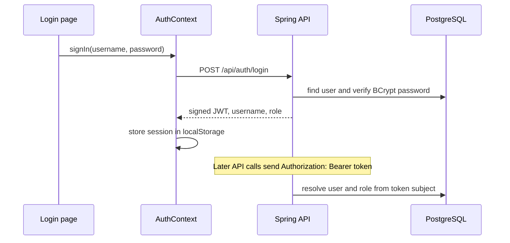

# Architecture

## System Overview

The browser application is a React single-page app. It calls a Spring Boot REST API over HTTP/JSON. The API uses Spring Security for stateless JWT authentication, Spring Data JPA/Hibernate for persistence, and PostgreSQL for storage.

```mermaid
flowchart LR
    Browser[Browser]
    FE[React pages and components]
    Client[API client and API services]
    API[Spring Boot REST API]
    Security[JWT filter and authorization rules]
    Controller[Controllers]
    Service[Domain services]
    Repo[Spring Data repositories]
    ORM[JPA / Hibernate]
    DB[(PostgreSQL)]

    Browser --> FE --> Client --> API
    API --> Security --> Controller
    Controller --> Service
    Controller --> Repo
    Service --> Repo --> ORM --> DB
```

## Backend Layers

- **Controllers** map HTTP routes to application operations and bind/validate request DTOs. Some straightforward CRUD controllers call repositories directly.
- **Services** hold the result and derived-data logic: `SlalomService`, `BiathlonService`, `OlympicStatisticsService`, and `TestDataService`. `JwtService` issues and validates signed tokens.
- **Repositories** are Spring Data JPA interfaces for users, athletes, countries, competitions, registrations, and result entities.
- **Entities** define the persisted domain model. Enums are used for competition type, gender, user role, and medal type.
- **DTOs** shape authentication, athlete reads, registrations, results/rankings, medal, statistics, and test-data responses. Not every controller uses a DTO: some return JPA entities directly.
- **Configuration** provides the stateless security filter chain, CORS policy, JWT filter, password encoder, exception mapping, and initial admin setup.

### Important services

- `SlalomService` selects first-run finishers, limits qualification to 30, computes reverse start order, and ranks athletes who finish both runs.
- `BiathlonService` computes penalty and final time, and ranks completed results.
- `OlympicStatisticsService` groups medals by country and calculates participant/medalist age statistics.
- `TestDataService` transactionally inserts matching demonstration entities only when missing.

## Frontend Layers

- `src/pages/` contains routed public, athlete, and admin screens.
- `src/components/` contains shared UI and role guards; `src/layouts/` supplies the app layout.
- `src/context/AuthContext.tsx` owns the frontend session state.
- `src/services/apiClient.ts` centralizes fetch calls, API base URL selection, bearer-token attachment, and API errors. Domain API wrappers live beside it.
- `src/types/` holds the TypeScript interfaces used by the page/service layer.
- `src/styles/` contains the visual design system and page styles.

## Request and Persistence Flow

1. A page calls a typed service function.
2. `apiClient.ts` adds JSON headers and, for authenticated calls, the stored bearer token.
3. Spring Security applies CORS and route authorization, then the JWT filter validates a bearer token and resolves the current account from the user repository.
4. A controller validates the request and performs the operation directly or delegates to a service.
5. A repository loads or persists JPA entities. Hibernate translates the operation to PostgreSQL SQL.
6. The controller returns an entity or response DTO; the frontend handles the HTTP response or `ApiError`.

## Authentication Flow

## Routes and Access

Public frontend routes are `/`, `/competitions`, `/competitions/:id`, `/rankings`, `/medals`, `/statistics`, `/login`, and `/register`. Athlete routes are `/athlete`, `/athlete/profile`, and `/athlete/competitions`. Admin routes are `/admin`, `/admin/athletes`, `/admin/competitions`, `/admin/registrations`, `/admin/slalom-results`, and `/admin/biathlon-results`. React role guards improve navigation behavior; backend security remains authoritative.

Several route components are present but remain placeholders: `/register`, `/athlete`, `/admin/slalom-results`, and `/admin/biathlon-results`.
