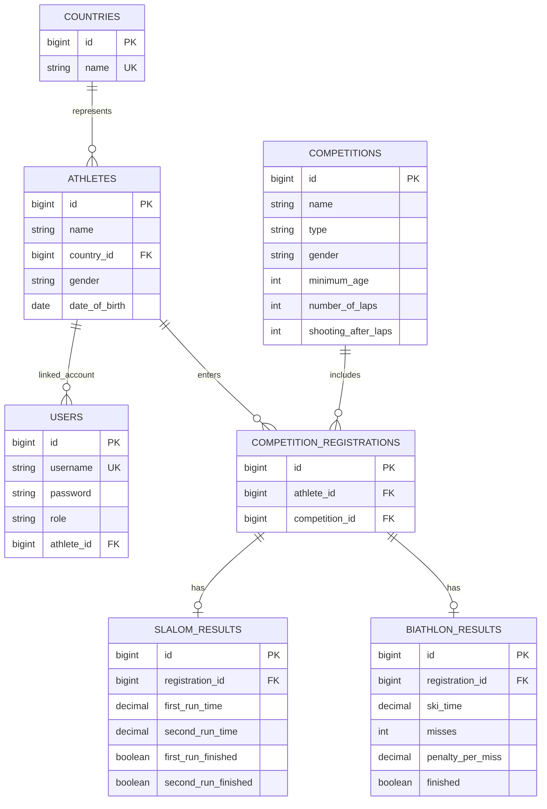

# Database

The persisted model is declared through JPA entities in `BE/src/main/java/com/example/winter_olympics/entity/`. The enum types `CompetitionType`, `Gender`, `Medal`, and `Role` are stored as enum values and are not tables.

The diagram shows relationships represented by entity mappings. `User.athlete` is an optional many-to-one link; the model does not enforce one user per athlete. `Athlete.country`, `CompetitionRegistration.athlete`, and `CompetitionRegistration.competition` are required many-to-one links. Each result entity has a required one-to-one link to a registration, with a unique `registration_id`.

## Tables and Fields

| Table | Purpose and important fields |
| --- | --- |
| `countries` | Country directory; `id`, unique non-null `name`. |
| `athletes` | Athlete identity; `id`, non-null `name`, required `country_id`, `gender`, and `date_of_birth`. |
| `competitions` | Event definition; `id`, `name`, `type`, `gender`, `minimum_age`, optional `number_of_laps`, `shooting_after_laps`. |
| `competition_registrations` | Athlete participation; required athlete and competition foreign keys. A unique constraint prevents duplicate athlete/competition pairs. |
| `slalom_results` | One Slalom result per registration; first/second run times and finish flags. Times use `numeric(10,3)` mapping. |
| `biathlon_results` | One Biathlon result per registration; ski time, aggregate misses, penalty per miss, finish flag. Ski/penalty times use `numeric(10,3)` mapping. |
| `users` | Login account; unique username, BCrypt password hash, role, optional athlete foreign key. |

No separate medal table exists. Medal standings are derived from current result rankings. There is no database column for a registration status or individual Biathlon shooting stages.

The current statistics service identifies medalists by matching medal response athlete names against athlete records rather than joining on athlete IDs. If multiple athlete records share a name, age statistics can include multiple same-name records.

## Relationship and Deletion Notes

The entity mappings do not specify cascade-delete behavior. Related rows can prevent deletion through foreign-key constraints; the global exception handler maps database integrity violations to HTTP 409. Remove dependent registrations/results through the API before deleting related records.

## Schema Management

Local Hibernate schema mode defaults to `update`. The current production profile also temporarily uses `update` for the empty-database bootstrap commit. After the Railway schema has been created and verified, production should return to `validate`. No Flyway, Liquibase, or other versioned migration setup is present in the repository.
