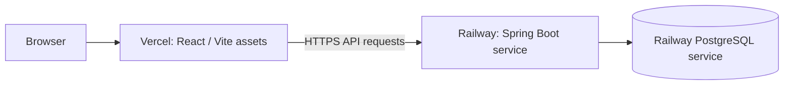

# Local Development and Deployment

This document describes repository configuration and the deployment arrangement supplied for the project: Vercel for the frontend and Railway for the Spring Boot API and PostgreSQL. No real production domains, `vercel.json`, Railway manifest, or Dockerfile are checked into this repository.

## Local Prerequisites

- Java 21
- Docker with Compose
- Node.js/npm compatible with the checked-in package lock
- Network access to PostgreSQL on the configured host port

## Local PostgreSQL

From the backend directory, copy the example environment file and set local-only values. Never commit `.env`.

```sh
cd BE
cp .env.example .env
# Edit .env: set DATABASE_PASSWORD, JWT_SECRET, and ADMIN_INITIAL_PASSWORD if needed.
docker compose up -d postgres
```

Compose runs `postgres:17-alpine`, publishes host port `5434` by default, and keeps data in the named volume `winter_olympics_data`. The backend defaults to database `winter_olympics` and user `olympics`; use the same password that was used to initialize the volume. Do not delete the volume to fix connection problems.

## Run the Backend

With `BE/` as the working directory:

```sh
cd BE
./mvnw spring-boot:run
```

The default backend port is `8081`; override with `SERVER_PORT`. Local configuration is in `application.properties`; it optionally imports `.env` from the working directory. The default `HIBERNATE_DDL_AUTO` is `update` for local development.

## Run the Frontend

```sh
cd FE
cp .env.example .env.local
npm ci
npm run dev
```

Vite defaults to `http://localhost:5173`. `VITE_API_BASE_URL` points the browser to the backend (local example uses `http://localhost:8081`). Vite variables are public browser configuration: never place a JWT key, database credential, or other secret in a `VITE_*` variable.

## Build and Test Commands

```sh
# Frontend production build
cd FE
npm run build

# Backend tests and package
cd ../BE
./mvnw test
./mvnw -DskipTests package
```

The full backend context-load test needs a configured, reachable PostgreSQL database. See [Testing](testing.md) for the scope of the checked-in test suite.

## Deployment Topology



Vercel and Railway are the deployment platforms provided for this project. This repository does not specify deployment URLs or platform-as-code settings. Configure variables in each platform’s service environment instead.

## Vercel Frontend Variable

| Variable | Required value |
| --- | --- |
| `VITE_API_BASE_URL` | Public base URL of the deployed Railway backend, without a trailing path. |

The backend URL was not provided in the repository, so this document does not invent one.

## Railway Backend Variables

Set `SPRING_PROFILES_ACTIVE=prod` on the Railway backend service. The `prod` profile requires:

| Variable | Purpose |
| --- | --- |
| `SPRING_DATASOURCE_URL` | JDBC PostgreSQL URL; must start with `jdbc:postgresql://`. Build it from the Railway Postgres `PGHOST`, `PGPORT`, and `PGDATABASE`. Do not assign Railway's `postgres://` `DATABASE_URL` directly. |
| `SPRING_DATASOURCE_USERNAME` | Reference the database service's `PGUSER`. |
| `SPRING_DATASOURCE_PASSWORD` | Reference the database service's `PGPASSWORD`; keep it as a platform-managed secret/reference. |
| `JWT_SECRET` | Private random string of at least 32 bytes. Never send to Vercel or the browser. |
| `CORS_ALLOWED_ORIGINS` | Exact browser origin(s) for the Vercel site; comma-separated if more than one. Wildcards are rejected. |
| `SERVER_PORT` | Port for the server. Railway deployments commonly reference the service's `PORT` variable. |

Railway variable references below assume the database service is named `Postgres`; substitute the actual service name if different:

```text
SPRING_DATASOURCE_URL=jdbc:postgresql://${{Postgres.PGHOST}}:${{Postgres.PGPORT}}/${{Postgres.PGDATABASE}}
SPRING_DATASOURCE_USERNAME=${{Postgres.PGUSER}}
SPRING_DATASOURCE_PASSWORD=${{Postgres.PGPASSWORD}}
SERVER_PORT=${{PORT}}
```

`JWT_EXPIRATION_MS` is configurable and defaults to 86,400,000 milliseconds. `ADMIN_INITIAL_PASSWORD` is required only if the initializer needs to create the `admin` account. `CORS_ALLOWED_ORIGINS` is required under `prod`; leaving it unset prevents the CORS configuration bean from starting. `DEMO_ATHLETE_PASSWORD` is needed only if an administrator runs the demo-data endpoint; it is shared by all generated demo-athlete accounts and should not be used for production users.

## Production Schema Bootstrap — Temporary Setting

At the time of this documentation, `application-prod.properties` uses `spring.jpa.hibernate.ddl-auto=update` because the Railway database was empty and needed an initial schema. This was explicitly committed as a temporary bootstrap measure. **After Hibernate has created the schema and the deployment is confirmed, change this setting back to `validate` in a separate change.** Do not leave `update` as the long-term production strategy.

The repository has no Flyway/Liquibase migration definitions. With `validate`, production startup expects the schema to have been created through an explicit database setup/migration process. Hibernate update can evolve schema from entities but does not replace versioned migrations.

## Production URLs

No Vercel frontend URL or Railway backend URL is recorded in the repository. Obtain actual origins from the deployed services, then use the Vercel origin for `CORS_ALLOWED_ORIGINS` and the Railway API base URL for `VITE_API_BASE_URL`.
